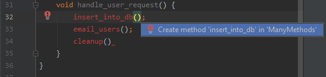
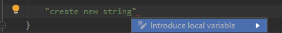

### Collection of Tips and Techniques for using IdeaVim and JetBrains' IntelliJ Idea, PyCharm etc

Sometimes, I take a break from JetBrains products. 

When I come back to JetBrains, I tend to lose track of the wonderful JetBrains shortcuts that I had previously "Muscle Memorized".

So, I am documenting some of the most useful ones here.

### Switch Between Vim and No Vim 
If IdeaVim installed, then some of the native JetBrains shortcuts might be taken up by IdeaVim. 
To access JetBrains shortcuts, I need to switch off Idea Vim.

To flip IdeaVim On/Off, I do Tools -> Vim Emulator

To quickly switch IdeaVim on and off without leaving the home row, I have remapped "Ctrl + Z".

To do the association,
- File 
  - Settings 
    - KeyMap 
      - Search for "Vim Emulator"
        - Right Click and "Add Keyboard Shortcut". Enter "Ctrl + Z"
        
So, I press Ctrl+z to disable IdeaVim, use the native JetBrains shortcuts, and then press
Ctrl+z again to switch back to IdeaVim.

### Map Alt + h,j,k,l to cursor motion similar to Vim
Sometimes, IdeaVim is not available at all. 

Or, in some organizations are moving away from IdeaVim Plugin and/or JetBrains' products entirely because of 
[some recent events](https://blog.jetbrains.com/blog/2021/01/06/statement-on-the-story-from-the-new-york-times-regarding-jetbrains-and-solarwinds/).

Vim users are accustomed to using the h, j, k, l keys to move cursor without leaving the home row.

JetBrains uses the arrow keys to move the cursor on the screen. 
However, the arrow keys are not easily accessible when my fingers are on the home row.

The mapping below helps me avoid moving fingers away from the home row when IdeaVim is either disabled or
not available at all.

- File 
  - Settings 
    - KeyMap 
      - Search for "Left" and add "Alt+h" as a  shortcut
      - Search "Right" and add "Alt+l" as a shortcut
      - Search for "Up" and add "Alt+k" as a shortcut
      - Search for "Down" and add "Alt+j" as a  shortcut
      
Then I can use h, j, k, l not only for cursor navigation but also to chose alternatives from auto suggestions without leaving the home row.
The one major downside is that I lose the existing bindings especially for Alt+j which by default(before my remapping) allows to traverse 
through "Usage Search" results.

### Undo
Alt + Backspace to undo anything 
 
### Ctrl Key Combination Shortcuts in JetBrains
 Key|Action|Notes
 ---|---|---
             *d| duplicate line | yy and p in Vim
             *h| show hierarchy
              i| implement  methods| similar to Ctrl + O
             *j| show available "live templates". see below for live templates 
              k| commit
              l| go to next match after Ctrl + f
              o| override | similar to Ctrl + i. In Vim, Ctrl + o, takes me to the last edit location
              y| yank/cut current line | dd in vim
          Ctrl | Run current file
      Backspace| delete last word behind cursor    
   
### Navigation
Key | Action
---|---
Ctrl + n                          | select and open class
Ctrl + Shift + n                  | select and open a file
Alt + Up/Down Arrow Keys          | go to next/previous methods
Alt + Left/Right Arrow Keys       | go to next/previous tab/file
Ctrl + Alt + Left/Right arrow keys| go back. navigate editing history(time travel :-))
Alt + 1                           | switch focus to Project View (to select files to edit). Esc to switch back to editor.
Ctrl + f12                        | jump to method within file/class
Ctrl + Shift + f12                | expand/focus editor. hide all other panes
Ctrl + b                          | go to definition
Ctrl + e                          | show recently modified files
Ctrl + Shift + e                  | show snippets of recent changes
Ctrl + Shift + +                  | expand all methods (Ctrl + + to expand current method)
Ctrl + Shift +  -                 | collapse all methods (Ctrl + - to collapse current method)
Alt + F7                          | find usages. then Alt + j to iterate through the matches. unfortunately, I have bound Alt+j for cursor movement
f2                                | navigate to next error. then use Alt + Enter 
Ctrl + [ or ]                     | Move cursor to start/end of code block. Ctrl + Shift + [ to Select
Ctrl+g                            | go to line

### Editing
    
#### Insert Lines
Key | Action
---|---
Ctrl + Enter | insert line before current line
Shift + Enter | insert line after current line  
 
#### Move Lines
Key | Action
---|---
Alt + Shift + Up Arrow | move line up
Alt + Shift + Down Arrow | move line down
   
#### Rename 
Key | Action
---|---
Shift + f6 | rename variable or method
Ctrl + f6 | refactor method signature

#### (Incremental)? Selection
Ctrl-w selects incrementally. Repeatedly pressing Ctrl + w, keeps extending the selected
area around the core from where I started.

Key | Action
---|---
Ctrl + w | incremental selection
Ctrl + [ or ]                     | Move cursor to start/end of code block. Ctrl + Shift + [ to Select
Ctrl + Shift + [ | select till code block start. also incremental
Ctrl + Shift + ] | select till code block end. also incremental
-                                 | to select code block, move to start of code block with Ctrl + [, then select till end with Ctrl + Shift + \]

#### What to do with the Selection
Key | Effect on Selection | Notes 
---|---|---
Ctrl + Alt + v                     | extract selection to new variable         | Alt + Backspace to Undo
Ctrl + Alt + m                     | extract selection to new method           | Alt + Backspace to Undo
Ctrl + Alt + f                     | extract selection to new field            | Alt + Backspace to Undo
Ctrl + Alt + p                     | extract selection to new parameter        | Alt + Backspace to Undo
Ctrl + Alt + l(or i)               | reformat code                             | Alt + Backspace to Undo
Ctrl + Alt + t                     | surround with "if", "try", "while", etc   | Alt + Backspace to Undo
Ctrl + /                           | comment or uncomment                      | Alt + Backspace to Undo
Ctrl(or Alt) + Shift + Arrow Keys  | move selection up or down                 | Alt + Backspace to Undo

### Writing New Code
#### Auto Completion
Key | Action
---|---
Ctrl + Space                      | auto complete *
Ctrl + Shift + Space              | smart auto complete

#### Use Error Correction to (auto)Write New Code
When writing a new function (see below example), first write the component function invocations(which might not have been defined yet).

The IDE will complain that the functions (like `insert_into_db`, `email_users`, and `cleanup`) are not defined.
Use `f2` to jump to the first error, and type Alt + Enter, and Intellij 

The editor will show errors.

Visit the first error by pressing f2, then press Alt + / for recommendations to resolve error
Select one of the recommendations to resolve error

Similarly, to create new variable, type in the variable value and then press Alt + Enter

#### Live Templates
Live Templates put in common "code blocks". For e.g. , instead of typing in 
`public static void main`, we can type in `psvm` or `main` and then select the code completion option.

mnemonic|note|---
---|---|---
sout         |System.out.println
psvm or main | private static void main                            | Alt + Backspace to Undo 
fori         | for loop                                            | Alt + Backspace to Undo 
foreach      | for each loop to iterate through array, or Iterable | Alt + Backspace to Undo 
ifn          | if null                                             | Alt + Backspace to Undo 
inn          | if not null                                         | Alt + Backspace to Undo   
itar         | iterate through array                               | Alt + Backspace to Undo 

### Debug or Run
key|note
---|---
f9 | debug (then f8 to step over)
f10 |run
    
